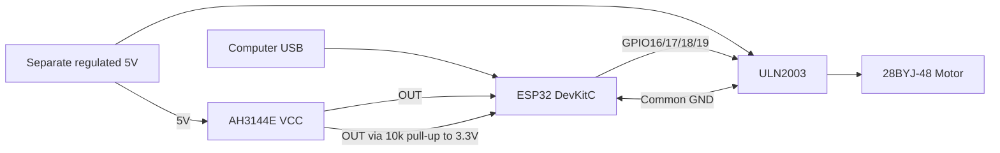

# First Digit Prototype-r0 Execution Guide

> Status: Parked for now. Resume this guide after the completed USB bring-up stage in `17-esp32-usb-bring-up-guide.md` when hardware integration work restarts.

This guide defines the immediate build milestone for Swan: `first-digit-prototype-r0`.

Primary objective:

> Prove that one digit can home repeatably, index across all 52 positions, and physically switch representative flap pairs without jams.

This is an engineering-validation milestone, not a finish-quality milestone.

## Why this milestone exists now

The project has enough artwork and geometry definition to begin physical validation. The highest-value risk is no longer symbol refinement. The highest-value risk is whether the mechanism can actually home, index, and flip reliably under repeated motion.

## Scope

In scope:

- One working digit module only.
- ESP32 + ULN2003 + 28BYJ-48 motion control.
- AH3144E Hall-based home detection with wheel-mounted magnet.
- Parametric wheel, frame, and flap interface geometry.
- A representative pilot print subset (approximately 6-10 flap pairs).
- Measured validation data for homing, indexing, jamming, and fit.

Out of scope for `first-digit-prototype-r0`:

- Full five-digit chassis and enclosure work.
- Full 52 decorated flap-pair production run.
- Deferred peripherals (audio path, RTC, permanent PCB integration, lighting).
- Cosmetic finish optimization.

## Required outputs

- One functioning single-digit rig that can run unattended test loops.
- CAD models for motor mount, Hall bracket, test hub or wheel, and serviceable frame.
- Firmware implementing homing, single-step index, absolute move to position, and serial telemetry.
- Test logs capturing pass/fail metrics and corrective actions.
- Updated dimensions in `artwork/flap-layouts/flap-spec.yaml` if print fit changes are validated.

## Work sequence

### Stage A - Electronics bring-up (no full wheel required)

Goal: prove each subsystem independently before integration.

Before first power-on, copy and confirm the pin map in `../electronics/wiring/first-digit-prototype-r0-wiring-map.md`.

Visual quick reference:

Current power fork for the next motor-only bench test:

- Use an enclosed 5V USB charger or power bank with a USB-to-screw-terminal breakout adapter for the motor rail.
- Keep the ESP32 on USB from the computer.
- Leave the open-frame 5V 5A PSU unused until it is enclosed, insulated, and strain-relieved.
- See decision record `2026-07-14-safe-motor-power-source-and-usb-breakout.md`.

0. Prerequisite: complete `17-esp32-usb-bring-up-guide.md` (no motor, no Hall, no external PSU)
- Keep only the ESP32 connected by USB.
- Complete the prerequisite bring-up checklist in `17-esp32-usb-bring-up-guide.md`.
- Confirm the board appears on a COM port in Windows Device Manager.
- Use VS Code + PlatformIO (`platformio.platformio-ide`) and upload a minimal serial sketch.
- Confirm serial output at `115200` baud before connecting any other hardware.
- If upload stalls at `Connecting...`, hold BOOT until flashing begins.

1. Motor-only test
- Wire ESP32 GPIO outputs to ULN2003 inputs.
- Use separate 5V motor power and common ground with ESP32.
- Run clockwise and counter-clockwise stepping test.
- Confirm smooth rotation (not vibration-only behavior).

Motor-only physical wiring checklist (exact connect-this-to-that):

1. Power fully OFF: unplug ESP32 USB and disconnect external 5V motor supply.
2. Plug the 28BYJ-48 motor connector into the ULN2003 white 5-pin socket.
3. Connect ESP32 `GPIO16` pin to ULN2003 `IN1`.
4. Connect ESP32 `GPIO17` pin to ULN2003 `IN2`.
5. Connect ESP32 `GPIO18` pin to ULN2003 `IN3`.
6. Connect ESP32 `GPIO19` pin to ULN2003 `IN4`.
7. Connect one ESP32 `GND` pin to ULN2003 `GND` (sometimes marked `-`).
8. Connect external 5V supply positive to ULN2003 `VCC` (sometimes marked `+`).
9. Connect external 5V supply negative to ULN2003 `GND` (same ground rail as step 7).
10. Re-check that ULN2003 control header labels match by printed text (`IN1..IN4`, `GND`, `VCC`), not by assumed left-right order.

Power-on order for this stage:

1. Connect ESP32 USB.
2. Upload firmware and open serial monitor at `115200`.
3. Apply external 5V to ULN2003/motor.
4. Run `f`, `r`, `c`, `x` tests.

2. Hall-only test
- Wire AH3144E VCC to external 5V, GND to common ground, and OUT to one ESP32 GPIO input.
- Add 10k pull-up from Hall OUT to ESP32 3.3V (open-collector sensor output).
- Do not power AH3144E VCC from ESP32 3.3V.
- Move magnet by hand and verify clean digital transitions.
- Mark active magnet pole for consistent assembly.

Hall-only physical wiring checklist (after motor-only is validated):

1. Power fully OFF before adding Hall wiring.
2. Connect AH3144E `VCC` to external 5V positive.
3. Connect AH3144E `GND` to common ground.
4. Connect AH3144E `OUT` to ESP32 `GPIO27`.
5. Add one `10k` resistor from AH3144E `OUT` to ESP32 `3V3`.
6. Confirm AH3144E pin orientation from your batch datasheet before power-on.

3. Combined test
- Run homing routine that rotates until Hall trigger is detected.
- Back off and re-approach if needed for repeatable edge capture.
- Report home events and sensor state over serial.

Exit criteria:

- Motor rotates reliably in both directions.
- Hall transitions are repeatable and noise-free.
- Homing routine can detect the same physical home point repeatedly.

Prerequisite exit criteria (from `17-esp32-usb-bring-up-guide.md`):

- ESP32 flashes successfully from VS Code + PlatformIO.
- Serial monitor shows stable expected output at `115200`.
- No motor, Hall sensor, or external 5V PSU was connected during this preflight check.

Reference images for this preflight live in `../media/reference-images/`:

- [2026-07-13-platformio-usb-preflight-01.png](../media/reference-images/2026-07-13-platformio-usb-preflight-01.png)
- [2026-07-13-platformio-usb-preflight-02.png](../media/reference-images/2026-07-13-platformio-usb-preflight-02.png)

### Stage B - Early mechanical proof parts (Blender/CAD entry point)

Goal: introduce only the minimum printed parts needed to test indexing mechanics.

Create in this order:

1. Motor shaft test hub with magnet pocket.
2. Adjustable Hall-sensor bracket.
3. Blank upper/lower flap pair with production geometry and no artwork.
4. Hinge-clearance coupon with multiple tolerance variants.
5. Partial wheel sector (6-8 positions) to test flap spacing and collisions.

After these pass, build the full 52-position wheel prototype with serviceable flange and shaft access.

Exit criteria:

- Magnet-sensor geometry is stable across repeated rotations.
- Selected hinge tolerance installs cleanly and survives flexing.
- Flaps settle by gravity and do not collide at neighboring positions.

### Stage C - Firmware indexing model for 52 positions

Goal: convert homed rotation into reliable logical positions `0..51`.

Implementation requirements:

- `home()`: find position zero from unknown state.
- `step_one_position()`: advance one logical index.
- `move_to(position)`: absolute move to any target `0..51`.
- `full_revolution_check()`: traverse cycle and re-detect home.

Important constraint:

- Do not assume exact integer steps-per-position from nominal values alone.
- Measure real full-revolution step count on your actual mechanism.
- Distribute step counts across 52 positions so total equals measured revolution count.
- Re-home periodically to bound drift accumulation.

Exit criteria:

- No single-position indexing drift after repeated cycles.
- Home is recovered consistently after full-revolution checks.

### Stage D - Representative pilot flaps (not full production)

Goal: test geometry and mechanics with realistic shape variety while keeping print cost low.

Print approximately 6-10 flap pairs, including:

- one simple numeral,
- one wide numeral,
- one dense numeral,
- one simple hieroglyph,
- one wide hieroglyph,
- one dense hieroglyph,
- one previously clipping-prone shape,
- one blank mechanical control pair.

Use temporary lightweight blanks for untested wheel positions.

Exit criteria:

- Representative shapes clear adjacent geometry.
- Artwork details print within safe zones and remain legible.

### Stage E - Reliability and serviceability validation

Run formal tests and record all outcomes.

Target metrics for `first-digit-prototype-r0`:

- Homing: same home location detected 20 consecutive times.
- Indexing: traverse all 52 positions and return home with no off-by-one event.
- Reliability: at least 500 commanded moves without jam.
- Flap motion: representative flaps fall and settle without manual assistance.
- Clearance: no persistent rubbing against wheel/flange/neighboring flap surfaces.
- Retention: flap features remain attached under repeated cycles.
- Servicing: motor, wheel, and at least one flap can be removed without full teardown.

Record for each test run:

- slicer profile and material,
- print orientation,
- measured dimensions,
- observed failures,
- corrective changes and result.

Use `19-first-digit-prototype-r0-test-log-template.md` to capture each run in a consistent structure.

## Definition of done for `first-digit-prototype-r0`

This milestone is complete when all criteria below are true:

- A single digit demonstrably homes and indexes all 52 logical positions.
- Representative flap subset flips reliably with no unresolved jam mode.
- Mechanical and firmware corrections are documented with rationale.
- Updated dimensional defaults are committed where validated.
- Deferred feature work remains deferred until this milestone is closed.

## Suggested implementation checklist

- [ ] Complete `17-esp32-usb-bring-up-guide.md` and record Stage 1 completion.
- [ ] Complete Stage A electronics bring-up logs.
- [ ] Print and validate Stage B proof parts.
- [ ] Implement Stage C homing/indexing firmware API.
- [ ] Print Stage D representative flap subset and validate fit.
- [ ] Run Stage E reliability sequence and capture evidence.
- [ ] Update BOM/docs/decisions from measured outcomes.
