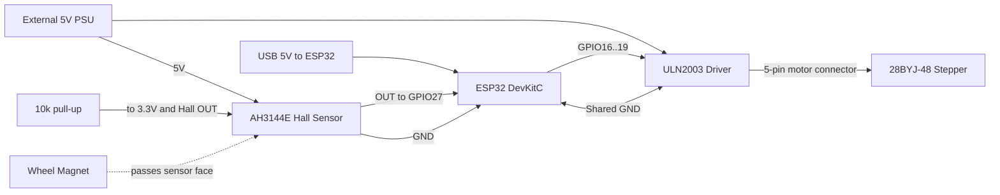
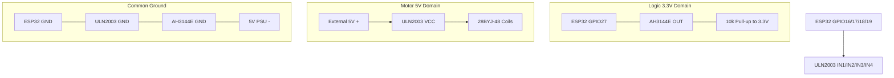

# First-Digit-Prototype-r0 Wiring Map

This is the canonical wiring reference for the first physical electronics bring-up.

Use this document before powering hardware and keep it synchronized with firmware pin assignments.

## Build state

- Current documented state (2026-07-13): pre-physical-build planning reference.
- First physical wiring session should copy this mapping into a dated run log under `projects/swan-countdown-timer/docs/test-runs/`.

## System wiring overview

- Controller: ESP32 DevKitC
- Motor driver: ULN2003 board
- Motor: 28BYJ-48 (5V)
- Home sensor: AH3144E Hall sensor
- Home marker: wheel-mounted magnet (2 x 1 mm N52)

## Visual guide - system block diagram



## Visual guide - signal and power paths



## Visual guide - bench layout sketch

Top-view placement suggestion for first bring-up:

```text
 +------------------+          +------------------------+
 |   ESP32 DevKitC  | GPIOs -> |  ULN2003 driver board  | -> 28BYJ-48 motor
 | (USB powered)    | GND  --- |  VCC from 5V PSU       |
 +------------------+          +------------------------+
		| 3.3V
		| GND
		| GPIO27
		v
 +------------------+
 | AH3144E on breadboard |
 | VCC -> external 5V      |
 | GND -> common GND       |
 | OUT -> GPIO27          |
 | OUT --10k-- 3.3V       |
 +------------------+

 Magnet moved by hand near Hall face for first sensor test.
```

## Connection table (what connects to what)

| From | To | Notes |
|---|---|---|
| ESP32 GPIO16 | ULN2003 IN1 | Stepper phase control |
| ESP32 GPIO17 | ULN2003 IN2 | Stepper phase control |
| ESP32 GPIO18 | ULN2003 IN3 | Stepper phase control |
| ESP32 GPIO19 | ULN2003 IN4 | Stepper phase control |
| ESP32 GND | ULN2003 GND | Common reference required |
| External 5V PSU + | ULN2003 VCC | Do not power stepper from ESP32 3.3V |
| External 5V PSU - | ULN2003 GND | Share ground with ESP32 |
| 28BYJ-48 motor connector | ULN2003 motor socket | Use keyed connector as provided |
| AH3144E VCC | External 5V PSU + | Typical A3144/AH3144 family supply range requires 5V-class rail |
| AH3144E GND | ESP32 GND | Common sensor ground |
| AH3144E OUT | ESP32 GPIO27 | Home input signal |
| 10k resistor | AH3144E OUT to ESP32 3.3V | Required pull-up for open-collector output |

## AH3144E pin orientation note

Validate pin order from the exact component batch before power-up.

- Hold sensor with flat/branded face toward you and legs downward.
- Confirm VCC/GND/OUT orientation against supplier datasheet for your batch.
- Mark verified pin orientation in the run log used for first power-on.

## Power and safety rules

- Keep ESP32 USB power and stepper 5V rail separate.
- Always tie grounds between ESP32 and ULN2003.
- Power AH3144E VCC from the external 5V rail (not ESP32 3.3V).
- Never connect Hall OUT pull-up to 5V when feeding an ESP32 GPIO.
- Power off before rewiring motor phases or sensor leads.

## Bring-up order

1. Motor-only wiring check and spin test.
2. Hall-only wiring check and magnet trigger test.
3. Combined homing test with low-speed approach.

## Pre-power checklist

- [ ] All grounds tied (ESP32, ULN2003, PSU negative, Hall GND).
- [ ] Hall VCC routed to external 5V rail.
- [ ] Hall pull-up resistor installed to 3.3V.
- [ ] Motor powered from external 5V rail.
- [ ] GPIO map in firmware matches this table.
- [ ] Magnet polarity tested and marked.
- [ ] First run log file created before switching power on.

## Post-test documentation checklist

- [ ] Record any firmware step-sequence changes if motor direction/torque tuning was required.
- [ ] Add wiring photo reference names to run log.
- [ ] Record observed Hall trigger distance range.
- [ ] Document any noise or false-trigger behavior.
