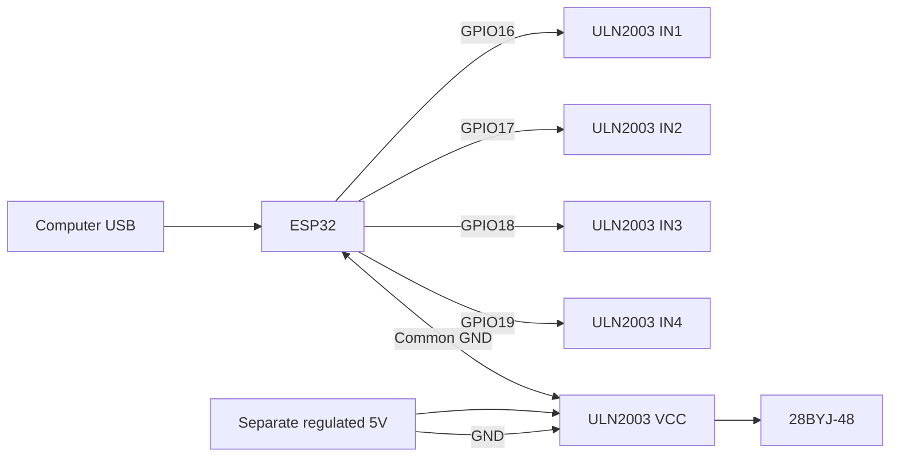

# First-Digit Prototype-r0 Firmware (Motor-Only Bring-Up)

This firmware stage is intentionally limited to motor-only interactive bring-up for an ESP32 + ULN2003 + 28BYJ-48.

It does not include Hall sensor logic, homing, indexing tables, networking, web features, or flap/CAD workflows.

## Safety and Power Model

Use this power arrangement:

```text
Computer USB ---------- ESP32

Separate regulated 5V -- ULN2003 -- 28BYJ-48
                         |
ESP32 GND ---------------+
```



Rules:

- Keep ESP32 powered from USB.
- Power ULN2003 and 28BYJ-48 from a separate regulated 5V source.
- Tie ESP32 GND, ULN2003 GND, and external 5V negative together.
- Do not feed external 5V into ESP32 while USB is connected.
- Disconnect power before rewiring.

## Exact Motor-Only Wiring

ESP32 to ULN2003:

- GPIO16 -> IN1
- GPIO17 -> IN2
- GPIO18 -> IN3
- GPIO19 -> IN4
- GND -> GND (or -)

Motor power:

- External 5V positive -> ULN2003 + / VCC
- External 5V negative -> ULN2003 - / GND
- Plug the 28BYJ-48 5-wire connector into the ULN2003 motor socket.

Do not connect Hall sensor wiring in this stage.

### Bench Wiring Steps (motor-only, literal order)

1. Unplug ESP32 USB and disconnect external 5V supply.
2. Plug motor into ULN2003 white socket.
3. ESP32 GPIO16 -> ULN2003 IN1
4. ESP32 GPIO17 -> ULN2003 IN2
5. ESP32 GPIO18 -> ULN2003 IN3
6. ESP32 GPIO19 -> ULN2003 IN4
7. ESP32 GND -> ULN2003 GND (or -)
8. External 5V + -> ULN2003 VCC (or +)
9. External 5V - -> ULN2003 GND (or -)

Pre-power verification:

- Control lines are on IN1/IN2/IN3/IN4 by label.
- External 5V is on ULN2003 VCC/GND only.
- No external 5V wire goes to ESP32 5V or 3V3 while USB is connected.
- ESP32 ground and ULN2003 ground are tied together.

## Commands

At 115200 baud, send:

- f : move forward 128 half-steps
- r : move backward 128 half-steps
- c : continuously move forward
- v : continuously move backward
- x : stop immediately and release all coils
- ? : print help and current configuration

Input handling ignores carriage return, line feed, and spaces.

## Expected ULN2003 LED Behavior

- During motion, ULN2003 channel LEDs should cycle in a repeating stepping pattern.
- At idle or after x, all channel LEDs should turn off because coils are released.

## Build, Upload, Monitor

From this folder:

```powershell
pio run
pio run -t upload
pio device monitor -b 115200
```

If your COM port is fixed, keep upload and monitor ports in platformio.ini in sync.

## Troubleshooting

If motor vibrates, buzzes, or rocks without rotating:

- Stop immediately with x.
- Remove motor power.
- Recheck common ground and IN1..IN4 wiring.
- Recheck that GPIO16/17/18/19 maps to IN1/IN2/IN3/IN4 exactly.
- Keep documented wiring canonical; correct direction/phase behavior in firmware sequence, not by swapping documented wires.

If ESP32 resets during motor movement:

- Verify ESP32 remains USB-powered only.
- Verify motor uses separate regulated 5V supply.
- Verify ground connection quality between ESP32 and ULN2003/supply.

## Safe Stop and Disconnect Procedure

1. Send x and confirm stop message.
2. Disconnect external 5V motor power.
3. Disconnect USB power.
4. Change wiring only when both supplies are disconnected.
